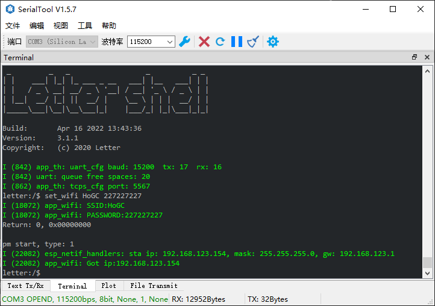

# esp_tcps_serial
ESP32 TCPS串口, 配合tcp工具实现透传, 支持使用串口终端和tcp终端进行配置

## 使用说明
1. 推荐工具[SerialTool](https://github.com/HoGC/SerialTool)    
    支持同时串口和tcp，支持颜色显示和终端操作    
    Tips: 原作者已经不在维护，存在一些bug, 我对已知的问题进行了修复，同时添加串口复位功能    
    [点击下载](https://github.com/HoGC/SerialTool/releases/tag/v1.5.5)    

2. 打入patch  
    本项目终端的实现使用了[letter-shell](https://github.com/NevermindZZT/letter-shell), 对于[esp-idf](https://github.com/espressif/esp-idf)适配请看[issues](https://github.com/NevermindZZT/letter-shell/issues/94),也可以在esp-idf打入项目下idf_esp32_letter_shell_patch
    ``` 
    git apply idf_esp32_letter_shell_patch
    ```
3. 配网
    * 直接使用串口终端设置    
        

    * 使用串口终端开启Smartconfig    
        

4. 串口透传
    * 使用tcp工具连接到设备tcp server，默认端口: 5567    
       

## 配置    
可以使用串口终端设置也可以使用tcp终端, tcp终端默认端口5568
1. wifi设置: `set_wifi SSID PASSWORD`    
    * SSID: WIFI名称, 必填    
    * PASSWORD: WIFI密码, 可选    

2. 串口设置: `set_uart -b 115200 -r 17 -t 16`    
    * -b: 波特率, 可选    
    * -r: RX引脚, 可选    
    * -t: TX引脚, 可选    

3. tcps设置: `set_tcps: -p 5567`    
    * -p: 端口号，必填


## 相关库    
* [letter-shell](https://github.com/NevermindZZT/letter-shell)

